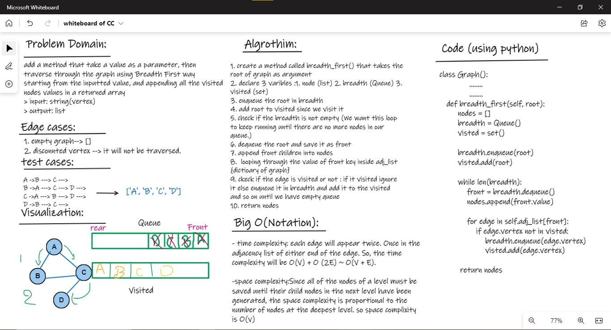

# Graph:

## Challenge01 - Breadth First:
1. create Node,Edge, Queue classes in separated files 
2. create a class called Graph as we did in demo.  
    1. create a method called breadth_first() that takes the root of graph as argument
    2. declare 3 variables :1. node (list) 2. breadth (Queue) 3. visited (set)
    3. enqueue the root in breadth 
    4. add root to visited since we visit it 
    5. check if the breadth is not empty (We want this loop to keep running until there are no more nodes in our queue.)
    6. dequeue the root and save it as front 
    7. append front children into nodes
    8.  looping through the value of front key inside adj_list {dictionary of graph}
    9. check if the edge is visited or not : if it visited ignore it else enqueue it in breadth and add it to the visited  and so on until we have empty queue 
    10. return nodes 
            
### WhiteBoard 

