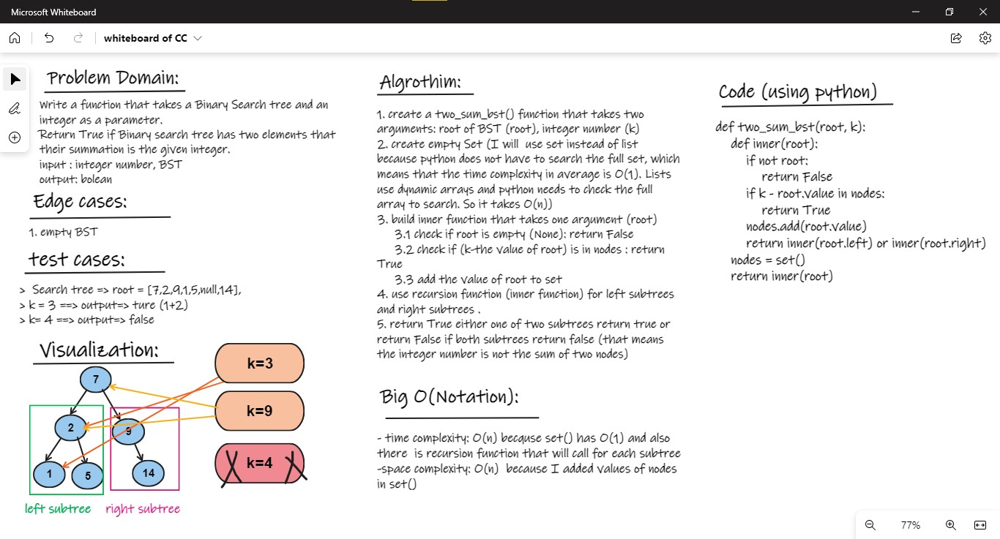

# HashTable:

## Challenge01 - Two Sum BST:
- First I needed to create a Node class and a Tree class
- create a two_sum_bst() function that takes two arguments 
    1. root of BST (root)
    2. integer number (k)
- create empty Set (I used set instead of of list because python **does not have to search the full set**, which means that the time complexity in average is **O(1)**. Lists use dynamic arrays and python **needs to check the full array to search**. So it takes **O(n)**)
- built inner function that takes one argument (root)
    - check if root is empty (None): return False 
    - check if (k-the value of root) is in nodes : return True
    - add the value of root to set 
    - use recursion function (inner function) for left subtrees and right subtrees
    - return True either one of two subtrees return true or return False if both subtrees return false (that means the integer number is not the sum of two nodes)
        
### WhiteBoard 

