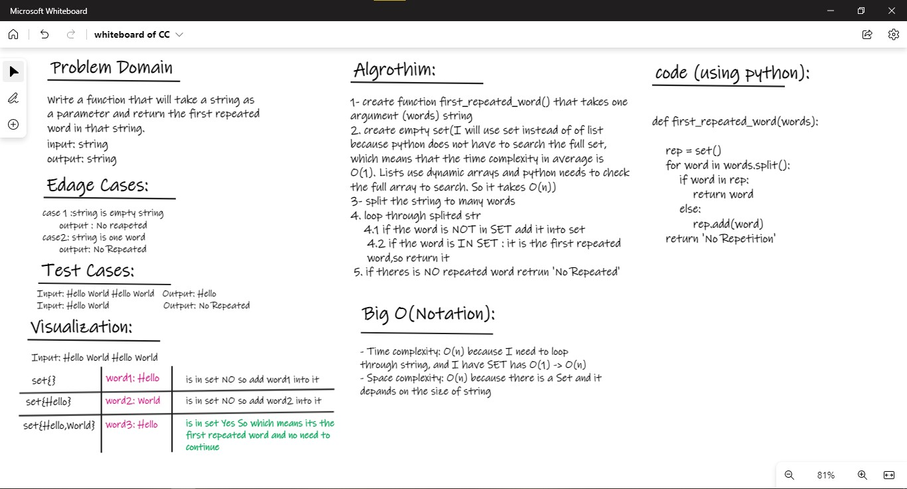

# HashTable:

## Challenge02 - Repeated Word:
- create function that takes one argument (words)->string 
- create set to add word each time if it unique
- split words and looping through it 
- if word is unique add it to set
- else that means its the first repeated word BINGO! 
- return it else return "No Repetition" 

### WhiteBoard 

