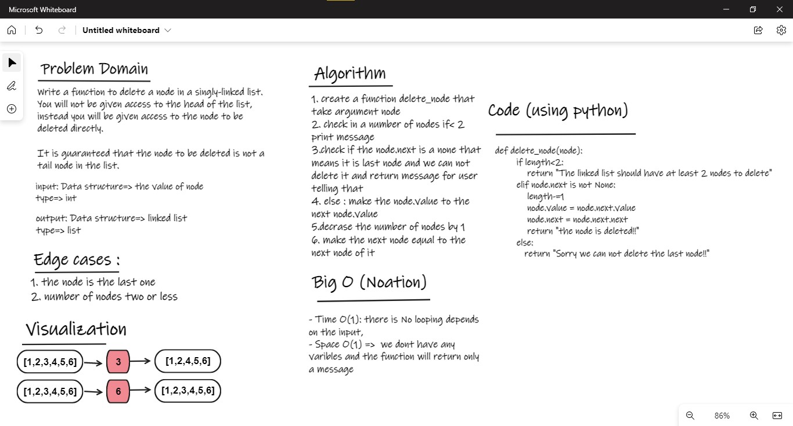

# Linkedlist:

## Challenge01 - Delete Node:
- First I needed to create a Node class and a Linkedlist class
- Create an append method that take a node as argument to append nodes inside a linked list.
- Create all_nodes method to return all appended nodes as a list 
- create a deleted_node  function that takes node as argument 
    - check if the node is the last node , and also you cant delete it 
    - else you can delete node directly.
- I have __name__ method to check my final code by 
    - create linkedList object and 6 nodes objects ,and append all nodes into linkedList 
    - print output for specific deleted node and show the linkedlist nodes 

### WhiteBoard 

