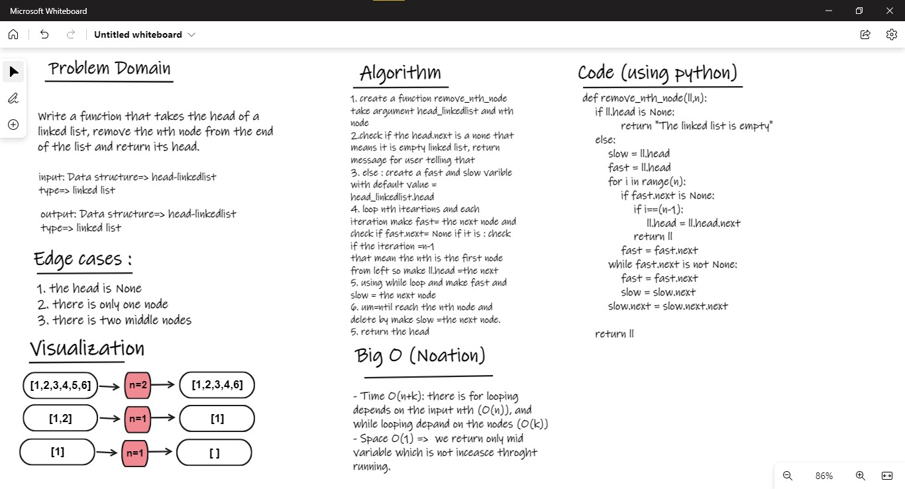

# Linkedlist:

## Challenge03 - Remove nth Node
- First I needed to create a Node class and a LinkedList class inside Classes.py
    - Create an append method that take a node as argument to append nodes inside a linked list.
    - Create all_nodes method to return all appended nodes as a list 
    - create a deleted_node that takes node as argument 
        - also check if the node is the last node , and also you cant delete it 
        - you can delete node directly, so you do not have an access for head 
    - create a mid_nodes method that returns middle nodes of linkedList
    - create find_middle_node method that returns the middle node 
- create remove_nth_node function inside a challenge03.py that takes a head of a linked list, remove the nth node from the end of the list. 
- test my function by using pytest, and create a test function inside test_Challenge03.py 

### WhiteBoard 

