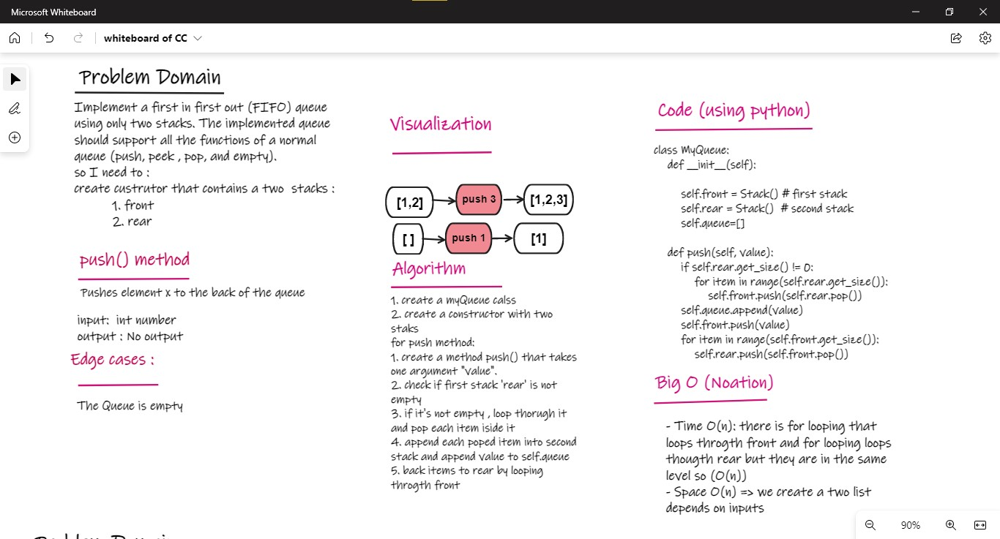
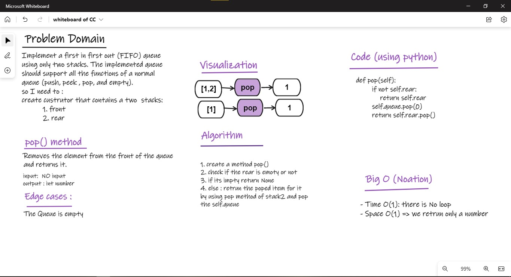

# Queue :

## Challenge01 - Implement Queue Using Stack
- first of all create a Classes.py to create a node and stack classes and implement stack as linked list.
- Create a myQueue class with two stacks that contains:
    - A constructor with two stacks 
        1. front of the queue
        2. rear of the queue
        3. queue with initial value []
    - push() method to  push element x to the back of the queue
    -  pop() method to remove the element from the front of the queue and returns it.
    - empty() method that returns true if the queue is empty, false otherwise
    - get_queue() method returns the list of elements of the queue
- test my function by using pytest, and create a test function inside test_Challenge01.py with fixture. 

### WhiteBoard 

