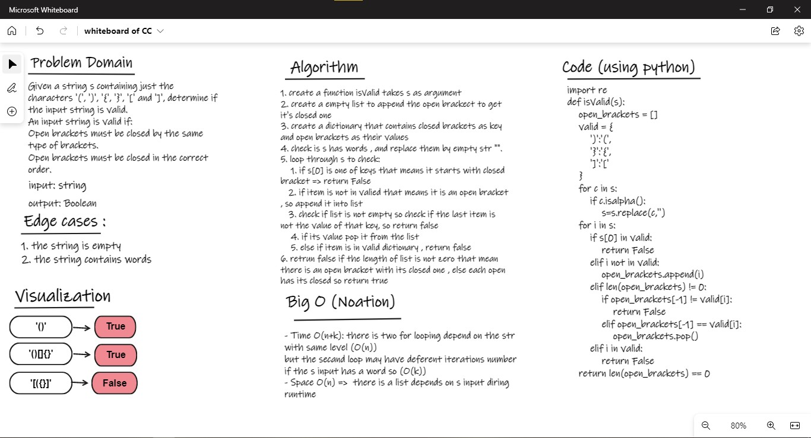

# Stack and Queue

## Challenge02 - Valid Parentheses:
- create A function isValid() that takes one argument of string (s)
- check if s contains words replace it with "" empty string
- loop through s to check if the item is valid by follow roles:
        1. Open brackets must be closed by the same type of brackets.
        2. Open brackets must be closed in the correct order.
        3. Every close bracket has a corresponding open bracket of the same type.
    if its valid return True or False if it is not.
### WhiteBoard 

