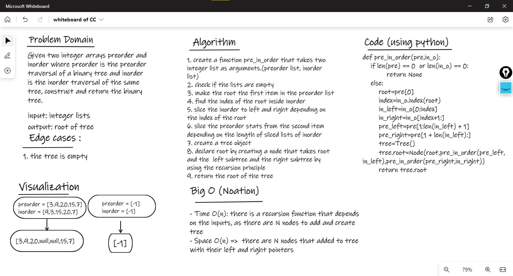

# Tree :

## Challenge01 - Construct BT from Preorder & Inorder:
- first of all create a Classes.py to create
    1. a node and Tree classes
    2. depth first and breadth first algorithms 
- Create a pre_in_order function with two integer lists as arguments :
    - use recursion function 
    - return the root of the tree 

### WhiteBoard 

