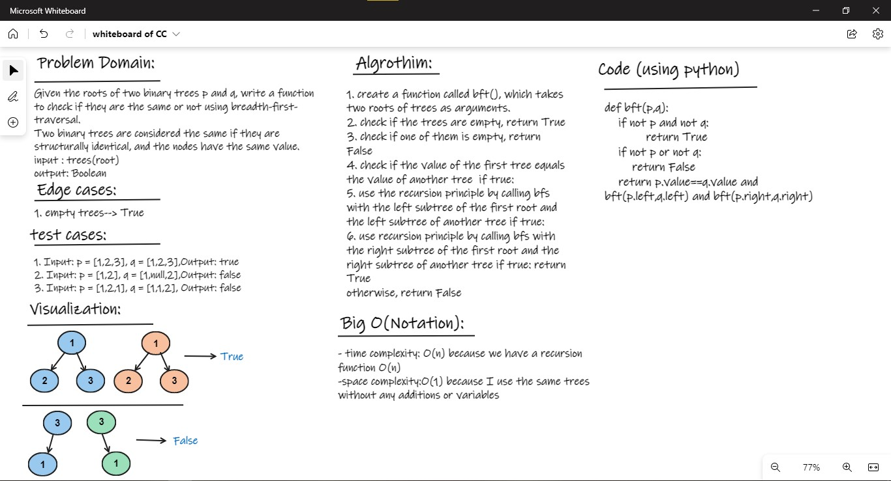

# Tree :

## Challenge02 - Breadth First Traversal:
- first of all create a Classes.py to create
    1. a node and Tree classes
    2. depth first and breadth first algorithms 
- Create a bft function with two root of trees as arguments :
    - use recursion function 
    - return True if two trees are equal and False otherwise

### WhiteBoard 

