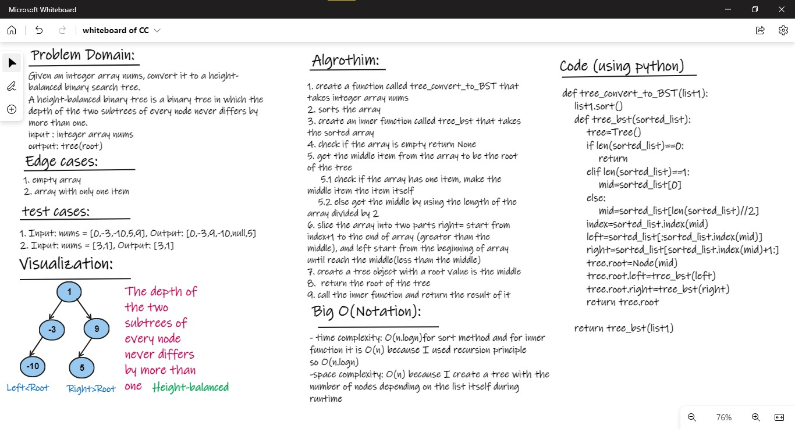

# Tree :

## Challenge02 - Breadth First Traversal:
- first of all create a Classes.py to create
    1. a node and Tree classes
    2. depth first and breadth first algorithms 
- Create a tree_convert_to_BST function with two integer list nums as arguments :
    - use sort() method to sort list and get the middle num
    - create a tree_bst function that takes a sorted_list as argument, and return root of tree
    - use recursion function 
    - return root of the tree 

### WhiteBoard 

